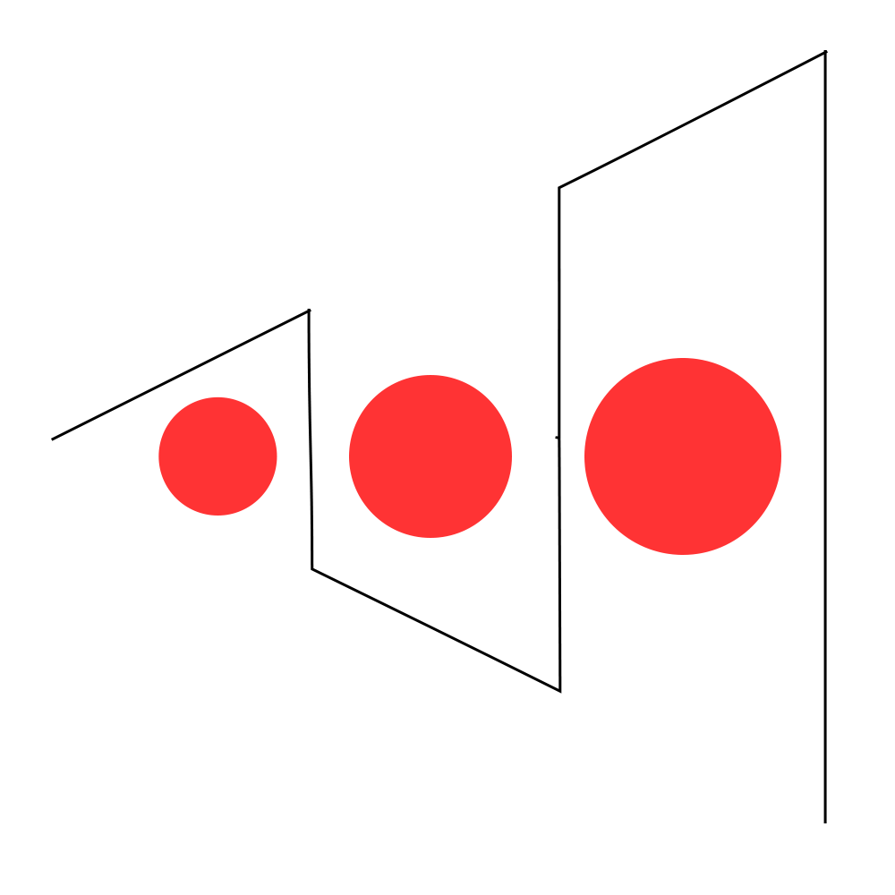

# Syzygy

Syzygy (sĭz′ə-jē) noun : an alignment of three celestial bodies

<p align="center">
  <picture>
    <source media="(prefers-color-scheme: dark)" srcset="assets/syzygy_dark.png" />
    
  </picture>
</p>

<h1 align="center">
  Syzygy
</h1>

<p align="center">
   A modern alternative to Burp Suite
</p>

## Usage

### Windows

1. Open Windows Explorer and navigate to that folder path.
2. Press `Win + R` and Go to `%AppData%\Roaming\syzygy\SyZyGy\config\keys\syzygy_ca.crt`.
3. Double click syzygy_ca.crt to open it.
4. Click Install Certificate...
5. Select Current User or Local Machine -> Next.
6. Choose "Place all certificates in the following store" -> click Browse.
7. Select Trusted Root Certification Authorities -> click OK -> Next -> Finish.

### Linux

1. Open a terminal and navigate to that folder path.
2. Run the following command:
   ```
   sudo cp syzygy_ca.crt /usr/local/share/ca-certificates/
   sudo update-ca-certificates
   ```

### MacOS

1. Open a terminal and navigate to that folder path.
2. Run the following command:
   ```
   sudo security add-certificates -d /usr/local/share/ca-certificates/
   ```
